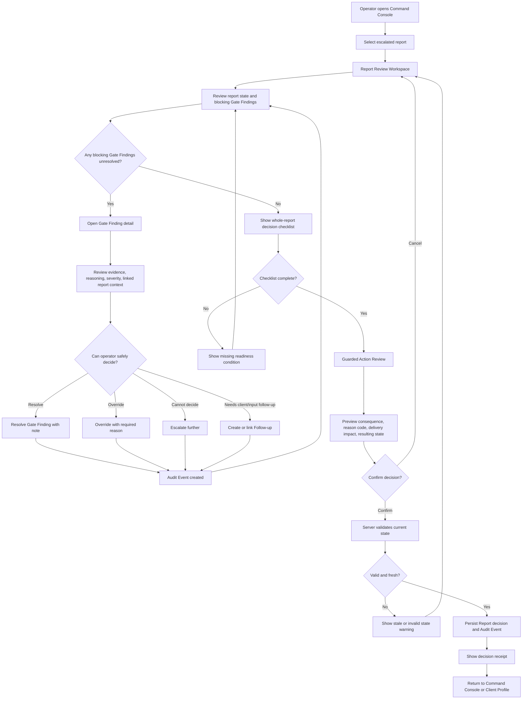
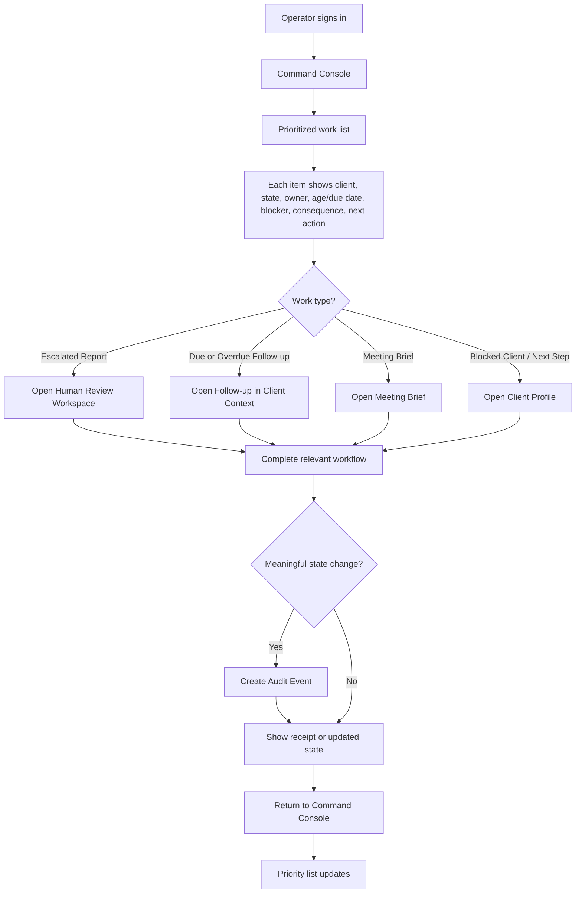
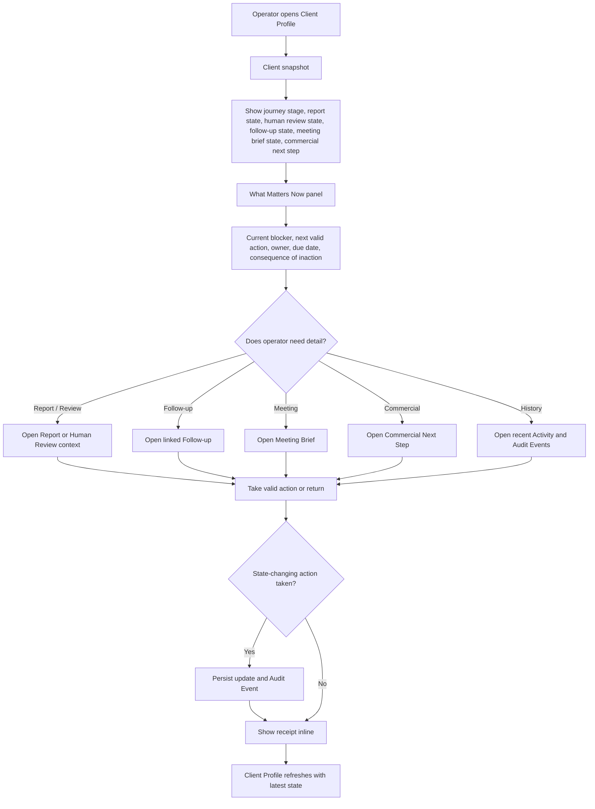
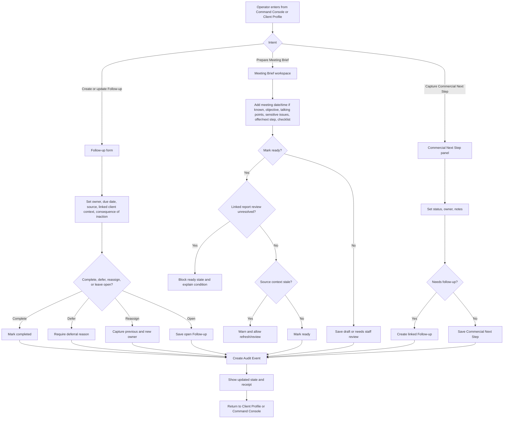

# UX Design Specification agenticai-net-au

**Author:** Lorin
**Date:** 2026-05-23

---

## Executive Summary

### Project Vision

The Agentic AI Staff Portal MVP is an internal workflow governance portal for safely managing AI Business Assessment delivery. Its purpose is to help staff see what needs attention, understand why work is blocked, take only valid lifecycle actions, and leave a durable audit trail.

The UX should be state-model-first rather than dashboard-first. The product must not create the appearance of operational control unless the underlying report, gate finding, follow-up, meeting brief, commercial next step, and audit states are clear and enforced.

The core experience should express this operating loop:

```text
See state → understand blocker → take valid action → record decision → move to next state
```

The MVP should prioritise safe report delivery and reliable human follow-through over broad CRM, sales cockpit, notification, or admin-governance functionality.

### Target Users

Primary users are internal Agentic AI staff:

- **Operators** who review escalated reports, resolve or escalate gate findings, manage follow-ups, prepare meeting notes, and keep client work moving.
- **Reviewers/admins** who need queue oversight, approval control, and confidence that high-risk decisions are auditable.
- **Consultation staff** who need accurate client context, meeting preparation, and a clear commercial next step before speaking with clients.

Indirect users are clients and the business owner. Clients benefit from safer reports, clearer follow-up, and better-prepared meetings. The business owner benefits from consistent process control rather than staff work hidden in memory, notes, or disconnected tools.

### Key Design Challenges

- Make report safety and review blockers immediately visible.
- Prevent unsafe whole-report approval while unresolved blocking gate findings, missing evidence, stale client context, or incomplete review requirements remain.
- Define valid and blocked actions per lifecycle state so staff cannot move work forward through ambiguous or unsafe transitions.
- Make blockers first-class objects with type, owner, age, required next action, and delivery-blocking or follow-up-blocking impact.
- Avoid passive dashboard metrics that do not lead to a valid next action.
- Keep lifecycle terminology consistent across Command Center, Client Profile, Human Review, Follow-ups, Meeting Briefs, Commercial Next Step, Activity, and Audit.
- Help staff understand source context without forcing them to hunt across unrelated screens.
- Distinguish operational memory from formal audit accountability.
- Keep follow-ups visible as commitments with owner, due date, source, linked context, status, and consequence of inaction.
- Make Meeting Brief freshness visible and testable so staff know whether a brief is safe to use for a consultation.
- Keep the Commercial Next Step lightweight and staff-entered without turning the MVP into a sales pipeline.

### Design Opportunities

- Position the Command Center as a risk-based work queue that answers: what is this, why does it matter, who owns it, what happens if ignored, and what is the next valid action?
- Use the Client Profile as an action-oriented briefing page centred on “What Matters Now.”
- Shape Human Review as a safety cockpit: gate finding list, finding detail, linked evidence, report context, approval checklist, and final report decision.
- Make Follow-ups feel like business promises by always showing owner, due date, source, linked client context, status, and completion record.
- Use clear state chips, warning banners, disabled actions, reason-code prompts, and audit previews to build staff confidence.
- Make Meeting Briefs lightweight in MVP while still warning when source context has changed or report review is unresolved.
- Add a state transition model to the UX specification so each lifecycle state has entry conditions, staff context, allowed actions, blocked actions, required decision records, exit conditions, and audit events.

<!-- UX design content will be appended sequentially through collaborative workflow steps -->

## Core User Experience

### Defining Experience

The core experience of the Agentic AI Staff Portal MVP is guided operational decision-making for paid AI Business Assessment delivery.

The staff job-to-be-done is:

> When paid assessment work is in motion, help me identify what needs attention, understand why, take the safest valid action, and leave a clear record so the next person can continue without guessing.

The portal is not a passive dashboard or CRM. It is a workflow governance surface that helps staff move assessment work through controlled states while protecting report quality, client readiness, and audit integrity.

The central operating loop is:

```text
Prioritise → Understand → Decide → Record → Advance or Commit Next Action
```

The core promise is:

> The portal should make the safest next action obvious, and make unsafe progress difficult.

This experience has two connected but distinct jobs:

- **Operational delivery governance:** keep the assessment moving safely through intake, payment, report generation, human review, delivery, consultation preparation, follow-up, and close-out.
- **Commercial continuity:** ensure staff have a current, explicit, staff-entered Commercial Next Step for follow-up and implementation conversations without turning the portal into a sales CRM.

### Platform Strategy

The MVP is a desktop-first internal web application for staff using mouse and keyboard during operational review, report quality checks, follow-up preparation, and consultation handoff.

The primary experience model has three layers:

1. **Command Center** — a shared operational queue that shows what needs attention, why it matters, who owns it, what happens if ignored, and the next valid action.
2. **Client/Profile Workspace** — an action-oriented workspace that helps staff understand the assessment context, report state, blockers, follow-ups, Meeting Brief freshness, Commercial Next Step, and recent material changes.
3. **Decision Controls** — state-aware, role-aware controls that allow staff to take valid operational actions, record rationale, preview audit consequences, and advance or block workflow progress.

The interface must be driven by a controlled assessment lifecycle. Each assessment should expose:

- current lifecycle state
- allowed actions for that state
- required fields before an action is valid
- blocker and escalation overlays separate from lifecycle state
- role-gated controls
- immutable audit events for controlled actions

Blockers and escalations are modeled as operational overlays on top of the current lifecycle state, not as replacement lifecycle states. For example, a report may be in human review and blocked by missing evidence, or ready for delivery and blocked by an unresolved escalation.

### Effortless Interactions

The portal should make these interactions feel low-friction and safe:

- identify the highest-priority work item and see the reason it was surfaced
- distinguish normal work, blocked work, stale context, overdue review, and escalation at a glance
- open a client workspace and immediately understand “What Matters Now”
- see available next actions without guessing which actions are valid
- understand why an action is disabled or unsafe
- record a decision once, without duplicating formal audit work elsewhere
- preview the audit event before committing a high-impact action
- mark “cannot proceed” as a valid outcome with a blocker reason and next required action
- see whether a Meeting Brief is fresh enough to use for consultation preparation
- enter or update a lightweight Commercial Next Step without managing a full sales pipeline

The Command Center priority model should be deterministic and explainable. Each prioritised item should expose reason text such as overdue review, unresolved blocker, stale Meeting Brief, pending client delivery, escalation, missing Commercial Next Step, or material change since last review.

Lightweight operational updates and controlled lifecycle decisions must feel different.

Lightweight updates may include:

- internal note
- contact detail correction
- assignment change
- reminder timestamp
- Meeting Brief reviewed marker
- Commercial Next Step text update

Controlled lifecycle decisions may include:

- approve report
- reject or request rework
- block report progress
- deliver to client
- escalate or resolve escalation
- mark consultation complete
- close assessment
- commit a Commercial Next Step as the current operational handoff

Controlled decisions require stronger validation, permission checks, rationale capture, audit preview, and an immutable audit event.

### Critical Success Moments

The make-or-break UX moments are:

- Staff can answer “What needs my attention now?” from the Command Center without hunting.
- Staff can see why a case is risky, blocked, stale, or overdue.
- Staff can take only valid next actions for the current lifecycle state and their role.
- Staff can safely choose “cannot proceed” without feeling they have broken the workflow.
- Staff can tell whether report review is complete enough for client delivery.
- Staff can tell whether a Meeting Brief is fresh enough for a consultation.
- Staff can record a decision and see a decision receipt showing what changed, who changed it, what happens next, and whether audit captured it.
- The next staff member can continue from the record without guessing.
- No paid client assessment silently stalls.

Failure conditions the UX must actively prevent include:

- a report moving forward without required quality review
- client delivery using stale or unsafe material
- blockers hidden inside free-text notes
- staff being unable to tell who decided what, when, or why
- a Meeting Brief being trusted after material source data changed
- Commercial Next Step being missing before follow-up or consultation
- audit preview implying staff can edit the formal audit log
- CRM, analytics, project-management, or report-authoring scope creeping into the MVP

### Experience Principles

- **State before dashboard:** every view should clarify the current lifecycle state, blocker state, and valid next action before showing secondary metrics.
- **Safe progress over fast progress:** the UX should keep paid assessment work moving only when quality, client readiness, and audit integrity are protected.
- **Explain every priority:** surfaced work must show why it appears and what consequence follows if ignored.
- **Cannot proceed is valid:** stopping unsafe movement, escalating, or waiting on missing information is a legitimate outcome, not a workflow failure.
- **Separate updates from decisions:** lightweight operational updates and controlled lifecycle transitions need different interaction weight, validation, permissions, and audit treatment.
- **Preview before commitment:** high-impact actions should show the audit event that will be recorded, including action, actor, timestamp, affected state, and required rationale.
- **Receipt after decision:** meaningful actions should end with a clear decision receipt showing what changed, who changed it, and what happens next.
- **Freshness is visible:** Meeting Briefs and review context should clearly show when material source data has changed since last review or brief generation.
- **Commercial continuity stays lightweight:** Commercial Next Step is a current operational handoff field, not an opportunity pipeline.
- **Audit remains formal:** operational memory can guide staff, but formal audit accountability must remain separate, immutable, and traceable.

### Testable Operational Guarantees

Every prioritisation, blocker, lifecycle transition, Meeting Brief freshness signal, escalation, and audit action must have visible reason text, defined validation rules, and an auditable before/after record.

Meeting Brief freshness should be invalidated when material context changes, including:

- client profile or intake details change
- report content or report status changes
- human review decision changes
- unresolved blocker or escalation is added or resolved
- Commercial Next Step changes
- consultation timing changes in a way that affects preparation
- a material staff decision is recorded after brief generation

Escalations must have entry and exit criteria: who can escalate, required reason, visibility in the queue, whether delivery is blocked, and what resolves the escalation.

Changed-since-last-review signals should focus on meaningful safety changes, not noisy generic updates.

## Desired Emotional Response

### Primary Emotional Goals

Internal staff should feel clear, protected, prepared, and in command of the next safe action — producing calm confidence that paid client work is being handled safely.

The Staff Portal should feel less like a surveillance or admin system and more like a trusted operational cockpit. It should show what needs attention, explain why, prevent unsafe actions, and help staff move work forward without second-guessing.

The emotional north star is:

> Protective clarity over administrative control.

Emotional design is operational risk reduction. The portal reduces fear of client harm, dropped work, irreversible mistakes, client-facing unpreparedness, and unclear accountability.

The core emotional job is to help staff answer:

> What paid client work needs my judgment now, what is risky, and what is the safest next move?

Primary emotional goals:

- **Clear:** staff understand priority, reason, status, ownership, blockers, and next safe action within the relevant working view.
- **Protected:** staff are protected from accidental client harm, premature delivery, missed follow-through, stale meeting context, unrecorded commercial promises, unclear accountability, and irreversible or poorly evidenced actions.
- **Prepared:** staff feel ready for the next human handoff, whether that is a client consultation, internal review, escalation, or follow-up.
- **In command of the next safe action:** staff understand what they can safely do, what they cannot do yet, what judgment is required, and what happens next.
- **Calm:** calm emerges from reduced ambiguity, surfaced risk, clear constraints, and visible next actions — not from hiding risk.
- **Accountable, not policed:** actions are traceable, but the tone is supportive, continuity-oriented, and focused on client protection rather than performance monitoring.
- **Efficient:** efficiency comes from reduced ambiguity and fewer unnecessary steps, not rushing high-impact decisions.

### Emotional Journey Mapping

When staff first enter the portal, they should feel oriented rather than overwhelmed. The Command Center should answer what needs attention, why it matters, what kind of operational attention is required, and what can safely happen next.

During the core experience, staff should feel guided and protected. The portal should make the safest valid action visible, explain blocked actions, and reduce fear of making an irreversible or unsafe decision.

After completing a primary task, staff should feel assured, relieved, and clear on what happens next.

The desired completion feeling is:

> This is safely handled, the record is clear, and the next responsibility is known.

When something is blocked or unsafe to proceed, staff should feel protected rather than arbitrarily stopped, informed rather than confused, guided rather than stranded, and calmly cautious rather than panicked.

A blocked state should feel like a safe pause, not a personal failure or system dead end. It should clearly explain:

1. what is blocked
2. why it is blocked
3. what risk is being prevented
4. who or what can unblock it
5. what staff can safely do now
6. whether escalation is needed
7. whether staff action is required

The desired blocked-state feeling is:

> I understand why I can’t proceed, and I know the safest next step.

When staff hand work to another person, they should feel confident that the next person will understand the situation without needing the story retold verbally.

When automation contributes to state, priority, freshness, or recommendations, staff should feel that the system is helpful but will not silently make risky decisions on their behalf.

When staff record a Commercial Next Step, it should feel like responsible continuity rather than opportunistic selling or CRM pipeline maintenance.

When staff make or discover a mistake, they should feel able to see what happened, correct course where appropriate, and leave a clear trail.

When staff return to the portal, they should trust that important changes, stale context, overdue work, unresolved blockers, and follow-up commitments will be surfaced without requiring manual checking.

Calm confidence comes from not having to keep the workflow in your head.

### Micro-Emotions

The most important micro-emotions are:

- **Confidence over confusion:** states, blockers, stale context, and next actions must be explicit.
- **Trust over skepticism:** automation, priority, and state changes must be explainable.
- **Protection over fear:** guardrails should feel like support, not punishment.
- **Calm caution over panic:** risk signals should be firm and visible without overusing alarming language or red-heavy UI.
- **Accountability over surveillance:** auditability should feel professional and traceable, not accusatory.
- **Preparedness over client-facing uncertainty:** Meeting Brief freshness, client context, and Commercial Next Step readiness should be visible before consultation or follow-up.
- **Relief over manual vigilance:** staff should trust that the portal will surface future issues if needed.
- **Guidance over powerlessness:** blocked actions should always include explanation and a safe alternative.
- **Focus over overload:** the interface should prioritise operational exceptions, not flood staff with metrics, alerts, and competing statuses.
- **Continuity over retelling:** staff should trust that handoffs preserve the operational story.
- **Responsible commercial confidence over sales pressure:** staff should be able to record commercial next steps without feeling pushed into a sales workflow.

The product should actively avoid making staff feel:

- confused by unclear states or hidden rules
- afraid of making the wrong decision
- watched, blamed, or policed
- rushed or panicked without true urgency
- frustrated by unexplained blocking
- powerless when they cannot proceed
- overloaded by too many alerts, queues, statuses, or metrics
- distrustful of unexplained automation or state changes
- falsely reassured that work is ready, safe, or complete when important uncertainty remains

Especially avoid the emotional outcome:

> Something is wrong and it might be my fault.

Instead aim for:

> The system has caught something important, and I know how to handle it.

### Design Implications

To create the desired emotional response, the UX should:

- use clear state labels, reason text, and next-action guidance
- show why items are prioritised and what would change priority
- distinguish warning, blocker, stale, overdue, escalation, and critical states without treating all issues as emergencies
- explain disabled or blocked actions with reasons, prevented risk, responsible owner or queue, and safe alternatives
- make “cannot proceed” a valid, guided path
- use calm, firm, non-judgmental blocked-state copy
- describe blocked conditions, not judge the person
- provide audit previews and decision receipts
- make receipts show what was known, decided, changed, recorded, and what happens next
- use continuity-oriented audit language
- explain automation-driven state, priority, recommendation, or freshness changes at the point of use
- make clear what the system knows, what it does not know, and where human judgment is required
- keep dashboards quiet and exception-led
- reduce alert noise and reserve red for genuine safety or delivery risk
- make Meeting Brief freshness and Commercial Next Step readiness visible before client conversations
- show new state, remaining risks, unresolved follow-ups, and next owner after meaningful actions
- support recovery by making previous decisions and correction paths understandable
- quietly reinforce that a paid client is waiting for safe, thoughtful work without creating guilt or panic

Use language like:

- “Recorded for continuity”
- “This creates a decision record”
- “This helps the next staff member understand what happened”
- “Report delivery is paused because two gate findings still require review”
- “This action is unavailable until the Meeting Brief is refreshed”

Avoid punitive or vague language like:

- “Compliance failure”
- “Invalid user action”
- “You are not allowed”
- “Not permitted”
- “Invalid state”

Emotion-design connections:

- **Clear** → visible priority, reason, state, ownership, and next safe action.
- **Protected** → unsafe actions prevented with explanation, prevented risk, and alternative path.
- **Prepared** → Meeting Brief freshness, client context, and Commercial Next Step readiness visible before client-facing activity.
- **In command of the next safe action** → staff understand system recommendations and can record human judgment where required.
- **Calm** → no unexplained urgency, noisy alerts, hidden state changes, or ambiguous completion states.
- **Accountable, not policed** → audit copy explains continuity, decision confidence, and client safety purpose.
- **Efficient** → fewer places to inspect, less manual reconstruction, and faster exception handling through clarity rather than speed pressure.

### Emotional Failure Modes to Avoid

The UX must avoid:

1. **Surveillance instead of support:** audit language feels like monitoring or blame rather than continuity and protection.
2. **Blocked and powerless instead of protected:** staff are prevented from acting without a clear reason, owner, consequence, or safe next step.
3. **Noise instead of calm:** alerts, badges, metrics, and priority reasons compete until staff stop trusting signals.
4. **Opaque automation instead of trust:** state changes, priorities, stale brief warnings, or recommendations appear without explanation.
5. **Ambiguous completion instead of relief:** staff act but cannot tell what changed, what was recorded, what happens next, or whether risks remain.
6. **False certainty instead of honest readiness:** the interface makes work appear ready, safe, or complete when important uncertainty remains.
7. **Sales pressure instead of commercial continuity:** Commercial Next Step feels like a pipeline demand rather than responsible client follow-through.
8. **Retelling instead of handoff continuity:** staff still need side conversations to understand what happened and what needs attention.

Protection must never feel like a dead end. Every prevented action should explain why it is unsafe and what staff can do next.

### Emotional Design Principles

- **Protective clarity over administrative control:** the portal should help staff make safe, informed decisions, not feel like a system for policing work.
- **Externalise uncertainty:** staff should not carry hidden doubt about report safety, blocker meaning, Meeting Brief freshness, ownership, next action, or audit record.
- **Every block needs a path:** a blocker must explain cause, owner, consequence, and safest next action.
- **Audit should reassure, not threaten:** receipts protect staff judgment by showing what was known, decided, and changed at the time.
- **Guardrails should feel helpful:** prevented actions should feel like the system protecting the client, staff member, and business.
- **Completion should create relief:** after action, staff should know what changed, what happens next, and whether anything still needs attention.
- **Trust requires explanation:** priority, stale signals, blockers, automation-driven changes, and recommendations must be visible and understandable.
- **Calm is a feature:** calm is created by reducing ambiguity, surfacing risk early, and making the safest next action obvious.
- **Preparedness protects handoffs:** staff should feel ready for client conversations, internal review, escalation, and follow-up.
- **Commercial continuity is not sales pressure:** staff-entered next steps should support responsible follow-through, not create CRM-style pressure.
- **Automation has boundaries:** the system may assist, prioritise, and surface signals, but risky progress requires understandable evidence and human judgment.
- **Recovery should be understandable:** when mistakes happen, staff should be able to see what happened, correct course where appropriate, and leave a clear trail.

### Emotional Acceptance Test

A staff member should be able to explain, without hunting:

> What needs attention, why it matters, what risk or blocker exists, what they can safely do next, what they cannot do yet, what will be recorded if they act, what happens next, and where human judgment is required.

## UX Pattern Analysis & Inspiration

### Inspiring Products Analysis

The Staff Portal should be inspired by three mature product patterns while remaining its own governed assessment workflow cockpit:

> Linear’s clarity + Stripe’s trust + Intercom/Zendesk’s operational queue.

These references should guide behaviour and interaction patterns, not surface imitation. The portal should feel inspired by these products, but should not feel like issue tracking, financial administration, support ticketing, CRM, analytics reporting, or performance tracking.

#### Linear

Linear is the strongest reference for workflow clarity and low-friction operational navigation.

Patterns to borrow:

- **State/status clarity:** every work item has an obvious lifecycle state.
- **Workflow queue:** clean lists, filters, assignment, ownership, and priority.
- **Low-friction navigation:** staff can move quickly without feeling trapped in an enterprise admin maze.
- **Calm visual design:** minimal chrome, strong typography, restrained colour, and clear hierarchy.

Why it fits:

The Staff Portal needs to feel like an operational queue, not a data swamp. Linear’s strength is that complex work remains legible because state, priority, ownership, and action are visible without excessive interface weight.

Translation guardrail:

> Borrow Linear’s state clarity, not its issue-tracker mental model.

Assessments are paid client workflows with evidence, review, delivery, and consultation consequences. The queue should make each assessment feel like paid client responsibility, not generic task closure.

#### Stripe Dashboard

Stripe Dashboard is the strongest reference for trust, precision, and serious operational control.

Patterns to borrow:

- **Trustworthy admin/control surface:** calm, precise, professional, and operationally serious.
- **Audit/history patterns:** clear event timelines showing who did what and when.
- **Decision confirmation:** important actions feel deliberate rather than casual.
- **Error/blocker handling:** issues are surfaced clearly without unnecessary panic.

Why it fits:

Staff will manage sensitive assessment states, quality review outcomes, client delivery readiness, payment-linked workflow, and audit-relevant decisions. Stripe’s financial-operations feel is a strong model for making serious actions feel safe, deliberate, and traceable.

Translation guardrail:

> Borrow Stripe’s trust, precision, and history patterns, not its financial admin density.

Audit history should support current decisions, not merely record past activity.

#### Intercom / Zendesk-Style Support Inbox

Intercom and Zendesk-style support inboxes are useful references for human-in-the-loop operational flow.

Patterns to borrow:

- **Human-in-the-loop workflow:** queues, ownership, escalation, pending states, and resolution.
- **Context beside action:** staff can see customer or business context while deciding what to do.
- **Status transitions:** open, pending, blocked, resolved-style mental models.
- **Internal notes and handoff cues:** support collaboration, continuity, and accountability.

Why it fits:

The Staff Portal is partly an operations desk where humans review, intervene, block, escalate, resolve, and move assessments forward. Support inbox patterns help staff understand what needs attention, who owns it, and what the next safe action is.

Translation guardrail:

> Borrow Intercom/Zendesk’s ownership, escalation, and context-beside-action patterns, not ticket-volume dynamics.

Support-inbox patterns should support relationship continuity, not ticket closure.

#### Safety-Critical Checklist Patterns

None of the three product references fully covers high-stakes approval or delivery with evidence gates. For high-impact actions, the Staff Portal should also borrow from safety-critical review patterns such as aviation checklists, medical review, security incident handling, and incident command workflows.

Patterns to borrow:

- explicit readiness checks
- hold or pause states
- reason-coded blockers
- pre-commit review
- post-action receipts

Translation guardrail:

> Checklist-style readiness review should apply only to high-impact actions, not routine navigation or low-risk updates.

### Transferable UX Patterns

The dominant mental model is:

> A governed assessment workflow cockpit: a shared operational surface where staff can see each assessment’s current state, risk, readiness, owner, and next safe action.

Protective clarity means staff are never asked to advance an assessment without enough context, evidence, and confidence that the next action is safe.

The strongest transferable patterns are:

- **Exception-first queue:** use Linear-style lists and filters to surface what needs attention now.
- **Visible lifecycle state:** every assessment should show a clear state, owner, priority reason, blocker status, readiness, risk, and next safe action.
- **Context beside decision:** use support-inbox patterns to place relevant client, report, blocker, Meeting Brief, and Commercial Next Step context near the action area.
- **Event timeline:** use Stripe-like audit/history patterns to show who did what, when, why, and based on what evidence.
- **Deliberate high-impact actions:** important state transitions should use readiness evidence, confirmation, rationale capture, and audit preview.
- **Calm issue surfacing:** blockers, stale context, and escalations should be visible and explanatory without making the whole interface feel alarming.
- **Internal handoff notes:** allow staff to leave continuity-oriented notes separate from formal audit events.
- **Clean filters and ownership:** staff should filter work by role, owner, state, priority, blocker, escalation, and freshness without creating Jira-like configuration complexity.
- **Operational signals over dashboard metrics:** replace passive charts and vanity counts with signals that change a valid next action, ownership, risk, or readiness.
- **Decision-first, not record-first:** assemble context around the decision instead of making staff navigate records manually.

### Simplified Pattern Principles

These principles matter more than copying any source product’s surface UI.

1. **Legible work** — every assessment shows state, owner, priority reason, blocker, risk, readiness, and next safe action.
2. **Trustworthy decisions** — every important action has evidence, rationale, confirmation, and receipt.
3. **Actionable handoff** — every staff transition preserves context, notes, owner, unresolved risks, and next responsibility.
4. **Readiness before progress** — high-impact actions require visible readiness evidence before commit.

### Operational Translation / MVP Pattern Commitments

#### Assessment Work Item Pattern

Every assessment row or work item should expose:

- lifecycle state
- owner
- priority reason
- risk level or risk reason
- blocker status
- readiness status
- last meaningful event
- next safe action
- consequence if ignored where relevant

Assessment rows should show readiness and risk, not just status and priority.

#### Detail View Pattern

The assessment detail view should expose:

- evidence and source context
- decision history
- current blockers
- readiness checklist
- formal audit timeline
- operational handoff notes
- Meeting Brief freshness
- Commercial Next Step readiness
- available actions and disabled-action reasons

History and handoff context may be visually adjacent, but audit separation must be structurally preserved:

- **Audit timeline:** formal, immutable, decision-grade.
- **Operational notes:** collaborative, contextual, handoff-oriented.

#### High-Impact Action Pattern

High-impact actions should require readiness evidence, rationale capture, confirmation, and a post-action receipt.

High-impact actions include:

- approve report
- request report revision or rework
- reject report readiness
- send or mark report delivered to client
- pause client delivery
- resolve or escalate a blocker
- close an escalation
- mark consultation prepared
- record consultation complete
- commit Commercial Next Step
- mark assessment closed
- mark cannot proceed
- handle payment/refund exception where it affects workflow progress

Safe pause, escalation, blocked, and cannot-proceed outcomes are successful outcomes when they prevent unsafe progress.

#### Receipt Pattern

For consequential actions, the portal should produce a clear decision receipt showing:

- who acted
- what changed
- when it changed
- why it changed
- what evidence was used
- what was recorded
- what happens next
- who owns the next responsibility
- whether risks, blockers, or follow-ups remain

#### Role-Shaped Emphasis

The portal may show different emphasis by role, but it must preserve one shared operational truth: assessment state, risk, owner, blocker, readiness, next safe action, and record.

Role-specific emotional assurances:

- **Operations Coordinator:** “I know what needs attention and what I can safely do.”
- **Quality Reviewer/Admin:** “I know the evidence, risk, and record behind the decision.”
- **Consultation/Follow-Up Staff:** “I know the client context and can continue the relationship responsibly.”

Different views must be driven by one canonical assessment record and event log.

### Risk, Blocker, and Readiness Definitions

These terms must remain distinct:

- **Risk:** what could go wrong if the assessment advances or stalls.
- **Blocker:** what prevents safe progress now.
- **Readiness:** what evidence indicates the assessment can safely advance.

A small risk/readiness taxonomy should be used consistently:

- **Ready:** required evidence is present and no blocking issue prevents progress.
- **Needs Review:** human judgment is required before progress.
- **Blocked:** progress is currently prevented by a known issue.
- **Escalate:** the issue requires higher-level or specialist intervention.
- **Cannot Proceed:** safe progress is not possible until an external or unresolved condition changes.

### Pattern Measurement Contracts

The inspiration strategy should remain testable through these contracts:

- **Legible work:** 100% of active assessments show state, owner, priority reason, risk or blocker status, readiness, and next safe action.
- **Trustworthy decisions:** high-impact actions cannot complete without required evidence, rationale, confirmation, and receipt.
- **Actionable handoff:** owner changes preserve summary, last decision, open blockers, unresolved risks, and next responsibility.
- **Readiness before progress:** progress actions are disabled or intercepted until required readiness evidence is present.
- **Audit support:** audit events answer what changed, who changed it, why, based on what evidence, and what is now safe.
- **Shared truth:** role-shaped views render from the same canonical assessment record and event log.

### Exception Scenario Tests

Before locking UI structure, the inspiration strategy should be pressure-tested against these scenarios:

- Stripe payment failed or requires manual attention.
- Annie intake quality is poor or incomplete.
- Business information is missing or contradictory.
- Report generation completes but reviewer rejects quality.
- Report delivery is paused for safety.
- Meeting Brief becomes stale after material source change.
- Commercial Next Step is missing before follow-up or consultation.
- Staff member hands work to another owner mid-workflow.
- Reviewer and operator disagree about readiness.
- Client delay, refund query, or implementation follow-up changes priority.

For each scenario, staff should still be able to identify state, risk, blocker, readiness, owner, and next safe action.

### Anti-Patterns to Avoid

The Staff Portal should avoid:

- **Jira-style configuration sprawl:** too many statuses, fields, filters, workflows, custom schemes, and administrative knobs.
- **Dense enterprise admin panels:** tables full of tiny controls, unclear hierarchy, and low signal-to-noise ratio.
- **Mystery-meat dashboards:** charts, metrics, or cards that do not lead to a clear next action.
- **Weak destructive-action confirmation:** irreversible or high-impact decisions must have explicit review, rationale, and audit preview.
- **Overly playful SaaS UI:** the portal should feel calm, professional, precise, and accountable rather than whimsical.
- **Hidden state changes:** staff should always know what changed, who changed it, why it changed, and what happens next.
- **Overloaded inbox patterns:** queues should not become noisy dumping grounds where every item appears equally urgent.
- **CRM drift:** Commercial Next Step should not become a full sales pipeline or opportunity-management system.
- **Productivity or performance tracking:** the MVP should not measure staff speed, ticket volume, or throughput as a primary UX surface.
- **Record-first admin burden:** staff should not need to inspect records manually before knowing what decision is needed.
- **Compliance checklist maze:** readiness checks should protect high-impact decisions, not create ceremonial friction everywhere.

### Pattern Translation Guardrails

- Borrow Linear’s state clarity, not its issue-tracker mental model.
- Borrow Stripe’s trust, precision, and history patterns, not its financial admin density.
- Borrow Intercom/Zendesk’s ownership, escalation, and context-beside-action patterns, not ticket-volume dynamics.
- Add safety-critical checklist patterns for report approval, blocker resolution, client delivery, escalation closure, consultation readiness, and Commercial Next Step commit.
- Keep one dominant mental model: a governed assessment workflow cockpit.
- Assessment rows must show readiness and risk, not just status and priority.
- Audit history must support current decisions, not merely record past activity.
- Support-inbox patterns should support relationship continuity, not ticket closure.
- Checklist-style readiness review should apply only to high-impact actions.
- If a signal does not change next action, ownership, risk, or readiness, it should not be prominent.

### Design Inspiration Strategy

#### What to Adopt

- Adopt **Linear’s workflow clarity** for queues, states, ownership, and lightweight navigation.
- Adopt **Stripe’s trust and audit precision** for decision records, event timelines, confirmations, and operational seriousness.
- Adopt **Intercom/Zendesk’s context-plus-action layout** for human review, escalation, handoff, and resolution workflows.
- Adopt **safety-critical readiness review** for high-impact progress decisions.

#### What to Adapt

- Adapt Linear-style lists for assessment lifecycle governance rather than software issue tracking.
- Adapt Stripe-style audit timelines for staff decision continuity rather than financial transaction history.
- Adapt support inbox ownership and escalation patterns for report review, blockers, Meeting Brief freshness, and client follow-up.
- Adapt support-style internal notes carefully so they support operational memory without replacing formal audit accountability.
- Adapt checklist patterns only where evidence, safety, delivery, or client commitment risk justifies the extra interaction weight.

#### What to Avoid

- Avoid copying Jira’s configurable workflow complexity.
- Avoid turning the Command Center into an analytics dashboard.
- Avoid making the Client/Profile Workspace feel like a CRM record.
- Avoid copying support-ticket volume dynamics.
- Avoid making audit history the dominant workspace at the expense of decision guidance.
- Avoid playful or consumer-style UI moments that weaken trust in serious operational decisions.
- Avoid any interaction pattern where the system changes state silently or makes readiness appear more certain than it is.

The inspiration strategy is:

> Use Linear for legible work, Stripe for trustworthy decisions, Intercom/Zendesk for actionable handoff, and safety-critical checklist patterns for readiness before progress — while keeping the Staff Portal focused on safe assessment delivery rather than project management, financial administration, support ticketing, CRM, analytics, or performance monitoring.

## Design System Foundation

### 1.1 Design System Choice

The MVP design system will use repo-owned CSS custom-property tokens and a local Svelte component layer as the source of truth. Tailwind and third-party UI kits are deferred unless deliberately introduced later.

The design system foundation is:

| Area | Decision |
|---|---|
| Tokens | Repo-owned CSS custom properties are the source of truth |
| Tailwind | Not part of MVP unless explicitly approved later |
| Components | Local Svelte components |
| Complex primitives | Svelte-native accessible primitives such as Bits UI are allowed where justified |
| shadcn-svelte | Patterns may be copied/adapted as recipes; no opaque runtime dependency |

This Step 6 decision extends the existing repo-owned design system foundation, including `src/lib/styles/DESIGN_SYSTEM.md`, rather than creating a parallel system.

The design system should not be a fully custom system, dense enterprise suite, or generic admin dashboard theme. It should be a disciplined internal workflow-governance interface.

### Rationale for Selection

This approach best fits the Staff Portal because it supports:

- SvelteKit/Svelte 5 alignment without React UI dependencies
- themeability without unnecessary framework churn
- calm, precise, trustworthy operational UI
- state-first workflow surfaces rather than generic dashboard components
- accessible high-impact decision patterns
- stable semantic structure for testing and auditability
- dependency-light implementation suitable for MVP delivery

The portal’s design language should express protective clarity over administrative control.

### Implementation Approach

CSS custom properties are the token authority. Any TypeScript token references must mirror those tokens and must not become a second source of truth.

Use local/simple Svelte components first. Use Bits UI or similar Svelte-native accessible primitives only for interactions with genuine accessibility complexity, such as dialogs, menus, popovers, tabs, tooltips, comboboxes, and complex confirmations.

Reusable UI primitives should remain business-agnostic. Domain workflow components should live separately, with the exact implementation location finalized during development, for example `$lib/components/workflow` or `$lib/components/portal`.

The MVP domain component layer should prioritise:

- assessment queue rows
- state chips
- risk indicators
- readiness status
- blocker banners
- stale/out-of-sync warnings
- evidence/provenance indicators
- generated-vs-human-reviewed labels
- reviewer attribution
- audit timelines
- audit previews
- decision receipts
- guarded high-impact action confirmations

Workflow states, risk levels, blocker states, readiness states, and action availability must be defined centrally in typed structures and consumed by UI components, server actions, and tests rather than duplicated as display-only strings.

### Customization Strategy

The design system should separate operational meaning into distinct axes:

- **Workflow status:** intake pending, payment received, report generating, human review, ready for delivery, delivered, follow-up due, completed
- **Severity/risk:** normal, caution, needs review, blocked, critical
- **Readiness:** ready, missing information, blocked, requires human approval
- **Action intent:** standard, client-facing, financial, destructive, irreversible, high-impact

Design tokens must cover colour, spacing, typography, focus, status, risk, readiness, destructive actions, disabled states, and dark-mode capability.

Dark mode should be token-capable, but should only ship in MVP if contrast, readability, and workflow-state semantics are fully verified.

Every workflow component should define required states:

- loading
- empty
- error
- stale data
- permission denied
- blocked by upstream dependency

Desktop-first density should support high-scan operational work:

- compact but breathable tables
- persistent state and action visibility
- no dashboard-card clutter
- keyboard-friendly queue navigation

High-impact actions are actions that change workflow state, notify users, trigger automation, affect billing/compliance, or cannot be silently undone.

High-impact actions should use a reusable guarded action pattern, such as `GuardedAction` or `SafetyCommit`, with these states:

- blocked
- ready
- confirming
- committing
- succeeded
- failed/recoverable

High-impact actions must include:

- consequence copy
- target entity confirmation
- server-side authorization
- idempotency where relevant
- audit preview
- guarded commit
- audit event creation
- post-action decision receipt
- recovery/error path

Confirmation intensity should be tiered to avoid modal fatigue:

- low-risk actions: inline confirmation or undo
- medium-risk actions: confirmation dialog with consequence copy
- high-risk actions: target confirmation, audit preview, guarded commit, receipt, and recovery path

Accessibility and testability are release constraints:

- WCAG 2.1 AA contrast minimum
- no colour-only status meaning
- keyboard-only operation for tables, lists, dialogs, and guarded actions
- visible focus states
- correct focus order
- dialog focus trap and return focus
- accessible labels, names, and roles
- screen-reader announcements for state changes, errors, receipts, and blockers
- reduced-motion support where motion is used
- stable role/name/label locators
- deterministic `data-testid` hooks for dynamic workflow objects where semantics alone are insufficient

Recommended durable test hook examples:

- `assessment-row`
- `assessment-action-approve`
- `audit-preview`
- `decision-receipt`
- `guarded-confirm-input`

Testing expectations:

- component-level accessibility and state tests for design system components
- integration/API tests for lifecycle transitions, audit writes, permission checks, readiness checks, and idempotent commits
- Playwright E2E coverage for the core loop: Prioritise → Understand → Decide → Record → Advance or Commit Next Action
- Playwright coverage for high-impact action paths

## 2. Core User Experience

### 2.1 Defining Experience

The defining experience is the **safe handoff loop**.

An operator opens a blocked or priority case and immediately understands its current state, why it needs attention, what risk is blocking progress, and which actions are valid. Before acting, they see a plain-language preview of the consequence. After acting, the portal records the rationale and returns a durable handoff receipt: what changed, why it changed, who owns the next step, and what risks remain.

The memorable moment is not:

> “I clicked approve.”

It is:

> “I saw exactly what was at risk, made the safest valid decision, and got proof that the handoff was recorded.”

The product’s emotional center is:

> **Clarity before action, proof after action.**

### 2.2 User Mental Model

Operators are not simply completing tasks. They are protecting assessment delivery quality, client readiness, commercial continuity, and audit integrity.

Their core questions are:

- What is stuck?
- Why does it matter now?
- What happens if I am wrong?
- What actions are actually valid?
- Who owns the next step?
- Can I safely walk away after acting?

The case state is the source of truth. The UI explains the state, but does not invent workflow logic.

### 2.3 Success Criteria

The safe handoff loop succeeds when:

- Operators can identify the current state and blocking reason within 5 seconds.
- Every priority label explains its cause.
- Every state-changing action has a preview.
- Operators never see or complete actions that are invalid for the current state.
- Invalid or unavailable actions explain the missing condition.
- Every completed meaningful action creates a persistent decision receipt.
- Every receipt shows previous state, new state, actor, timestamp, rationale, next owner, and audit reference.
- Stale state is detected before commit.
- External communications require recipient and content preview.
- Audit trail entries match one-to-one with user-visible receipts.
- A new operator can open a case midstream and understand the story in under 60 seconds.

### 2.4 Novel UX Patterns

The portal combines familiar operational patterns in a specific way:

- Linear-style state clarity
- Stripe-style trust and audit precision
- Support-inbox ownership and escalation patterns
- Safety-critical preview-before-commit patterns

The novel element is not a new control. It is the combination of:

> state truth + visible risk + valid action constraints + audit-backed receipt.

The interface should make the right action obvious, the wrong action unavailable, and the consequence visible before commitment.

### 2.5 Experience Mechanics

The safe handoff loop works as follows:

1. **Initiation**  
   The operator opens a priority or blocked case from the Command Center.

2. **Orientation**  
   The case shows current state, blocking reason, priority reason, owner, age, source signals, and consequence of inaction.

3. **Validity**  
   The UI shows only server-authorized actions for the current state, actor role, required artifacts, and prior decisions. Disabled actions explain what condition is missing.

4. **Preview**  
   Before a meaningful state-changing action, the portal previews:
   - current state
   - proposed new state
   - rationale required
   - data being saved
   - audit event to be created
   - client-facing or downstream impact
   - next owner
   - remaining risks

5. **Commit**  
   The operator confirms the decision. The server validates the transition, records the audit event, and rejects stale or invalid actions.

6. **Receipt**  
   The portal displays a persistent handoff receipt generated from the persisted audit event, not optimistic client state.

7. **Continuation**  
   The next operator can continue from the receipt, audit trail, and case state without reconstructing the story manually.

## Visual Design Foundation

### Color System

The Agentic AI Staff Portal should feel like a calm governance console, not a productivity dashboard. Its visual system should create protective clarity: operators see the current state first, understand the reason and evidence second, and only then act.

The existing slate-and-blue brand palette remains the foundation. Slate provides the stable operational surface. Blue guides safe progression, review context, and recommended next actions. Amber marks items needing attention before action, including stale evidence, unresolved risk, or handoff uncertainty. Green is reserved for proof-backed outcomes: recorded, synced, resolved, or confirmed. Red is used sparingly for blocked, unsafe, destructive, failed, or irreversible actions.

Visual semantics must distinguish operational state, business risk, and readiness. These axes must not be collapsed into a single colour meaning. Components should use product-meaning variants such as `risk="warning"` or `readiness="ready"` rather than visual names such as `color="amber"`.

Use repo-owned CSS custom properties in `src/styles.css` as the styling source of truth. `design-tokens.ts` is reference-only and must not introduce a runtime styling dependency. Extend the existing palette only where needed, including semantic danger tokens for destructive actions, failed validation, critical risk, and unsafe handoff states.

### Typography System

Typography should use Inter with a compact, precise hierarchy suitable for internal operations. State labels, timestamps, owners, evidence, and next actions should be more prominent than decorative headings.

The typography should feel professional, precise, calm, and operational rather than promotional. The MVP should use a small practical hierarchy: page title, section title, body text, and small/meta text. Avoid introducing a full type scale beyond what the MVP screens need.

Text hierarchy should support fast scanning under operational load. Priority reasons, blocked-state explanations, stale-context indicators, action consequences, validation messages, and receipts should be easier to find than secondary descriptive content.

### Spacing & Layout Foundation

Layout should be desktop-first, scan-first, and calm under pressure: state first, reason second, action third. Decision controls should sit beside their evidence and consequence preview. Every meaningful action should show the exact state transition before commit and persist a receipt afterward showing what changed, who changed it, when, and what proof supports it.

Spacing should be compact but readable, using consistent relationships around 8px, 12px, 16px, and 24px. The interface should support high-scan operational work without dense enterprise-admin clutter. Tables, lists, panels, and forms should preserve visible focus states, clear row/action separation, readable labels, and sufficient target sizes.

The portal should prefer one-column forms and simple two-column summary/detail layouts where context must sit beside decisions. Do not introduce layout complexity beyond what is needed for the safe handoff loop.

### Accessibility Considerations

Accessibility is a release contract: WCAG AA contrast, no colour-only status, complete keyboard operation, visible focus, dialog focus trap and restoration, screen-reader announcements for handoff-critical state changes, stable accessible labels, and intent-based test hooks are required for core flows.

Every handoff-critical state must include a persistent text label, non-colour cue, accessible name, and stable test hook. Visual contracts should be testable for state, risk, readiness, validation messages, keyboard flow, and receipt generation.

Interactive and stateful components should expose stable `data-testid` hooks based on domain role, not layout position or visual label. Examples include `handoff-readiness`, `handoff-preview`, `validation-error`, and `audit-receipt`.

The interface should never ask an operator to act before it has shown them why the action is safe, necessary, and auditable.

## Design Direction Decision

### Design Directions Explored

Six visual design directions were explored for the Agentic AI Staff Portal MVP:

1. **Command Console** — a state-first operational command surface for priority cases, blockers, valid next actions, and audit-backed handoff progress.
2. **Split Decision Workspace** — a two-pane case review pattern that keeps context, evidence, history, and decision controls adjacent.
3. **Inbox Triage Board** — an ownership and escalation lane model for queue grouping and operational handoff visibility.
4. **Safety Review Cockpit** — a checklist-style readiness and consequence review pattern for high-impact actions.
5. **Audit Timeline First** — a receipt-led pattern where decision history, proof, and state transitions are dominant.
6. **Executive Exceptions** — a quiet oversight pattern for exception review and executive/admin reporting.

### Chosen Direction

Lock **Direction 1: Command Console** as the MVP foundation, defined as a **state-first governance console** rather than a generic productivity dashboard or power-user command center.

The Command Console should prioritize current state, blockers, ownership, evidence, readiness, and next safe action over passive metrics or broad dashboard analytics. Its purpose is to support the safe handoff loop:

```text
See state → understand blocker → take valid action → record decision → move to next state
```

The chosen composition borrows selectively from the other directions:

- Use **Direction 2: Split Decision Workspace** as the core case/detail pattern where context, evidence, decision rationale, history, and controls sit side by side.
- Use **Direction 4: Safety Review Cockpit** as the guarded-action pattern for high-impact actions, including readiness checks, consequence copy, risk-proportionate confirmation, and recovery paths.
- Use **Direction 5: Audit Timeline First** as the receipt and evidence model, ensuring every meaningful state transition produces visible proof after action.
- Treat **Direction 3: Inbox Triage Board** as secondary inspiration only for queues, ownership visibility, and escalation triage. It must not replace the state-first operating model.
- Treat **Direction 6: Executive Exceptions** as future/admin oversight inspiration and out of MVP scope.

The MVP emotional target is:

> **Clarity before action, confidence during action, proof after action.**

### Design Rationale

This direction best fits the Staff Portal because the product is not trying to make staff feel fast for its own sake. It is trying to make them feel safe, informed, and accountable while governing AI-assisted assessment delivery.

The Command Console reduces the highest MVP risks by making state, risk, readiness, valid actions, and receipts explicit. It supports operators who need to know what is stuck, why it matters, what can safely happen next, and whether they can walk away after acting.

The supporting patterns prevent the console from becoming either too shallow or too complex:

- The split workspace prevents unsafe decisions from summary data alone.
- The guarded-action pattern creates intentional friction for approval, rejection, handoff, escalation, retry, notification, billing/compliance, destructive, or otherwise high-impact actions.
- The audit receipt pattern makes proof visible immediately after action instead of burying accountability in a separate audit area.

The MVP should use **one workflow system with contextual compositions**, not multiple competing interface architectures. Supporting patterns appear inside the Command Console operating shell rather than as separate navigation paradigms.

### Implementation Approach

Implement the chosen direction as a static, route-driven, component-local, action-first SvelteKit experience using repo-owned CSS custom properties and local Svelte components.

Implementation constraints:

- Use one shared workflow vocabulary for state, blocker, available action, disabled reason, risk, readiness, validation, owner, and audit trail.
- Use one action contract across surfaces: label, eligibility, disabled reason, risk level, confirmation requirements, server-side validation, and audit output.
- Use one visual grammar for state, risk, readiness, validation, and audit semantics. Do not introduce screen-specific colours or badge meanings.
- Use one decision-recording path so actions from the console, split workspace, or guarded-action view all create the same type of audit-backed receipt.
- Keep the MVP component set narrow, for example: `CommandConsole`, `TaskCard` or `ActionRow`, `DecisionWorkspace`, `GuardedActionPanel`, `AuditTimeline`, and `StatusBadge`.
- Expose handoff-critical information as visible text and stable machine-readable UI metadata, not colour, iconography, animation, or layout alone.
- Cover the canonical safe handoff loop with end-to-end, accessibility, and audit-contract tests: case intake → state assessment → staff decision → guarded review where required → confirmation → audit receipt.

Do not introduce command registries, generic workflow engines, configurable dashboards, advanced audit filtering, executive exception dashboards, theme generators, third-party UI kits, or Tailwind for the MVP.

## User Journey Flows

### Safe Report Review / Handoff Flow

The highest-risk journey is the Human Review path for escalated reports. The operator must understand why the report is blocked, review Gate Findings, resolve or escalate them, and only then make a whole-report decision.



Success state: the operator sees a durable receipt showing previous state, new state, actor, timestamp, reason code, review note, next owner, and audit reference.

Primary failure protection: whole-report approval is unavailable while unresolved blocking Gate Findings remain.

### Command Console to Priority Work Flow

The Command Console is the MVP operating entry point. It should help staff identify what needs action today without becoming a passive dashboard.



Success state: staff can identify the current blocker and next valid action within 5 seconds.

Primary failure protection: passive metrics are not shown as priority work unless a valid next action exists.

### Client Profile Context Recovery Flow

This journey supports a staff member opening a client midstream and understanding the story without relying on memory or disconnected notes.



Success state: a new operator can understand the client's current operational story in under 60 seconds.

Primary failure protection: the Client Profile must not introduce lifecycle terms that conflict with Command Console or Human Review.

### Follow-up / Meeting / Commercial Next Step Flow

This flow covers staff continuity after report governance: follow-ups, meeting preparation, and simple Commercial Next Step capture.



Success state: staff continuity is visible: who owns the next action, when it is due, what source created it, and what happens if it is ignored.

Primary failure protection: Meeting Brief cannot be marked ready while linked Report review is unresolved; Commercial Next Step must not appear AI-generated or scored.

### Journey Patterns

Across all four journeys, the Staff Portal should standardize these patterns:

#### Navigation Patterns

- Command Console → Detail Workspace → Receipt → Return
- Client Profile → Linked Context → Action → Inline Receipt
- Priority work always links to the object where the valid action can be completed

#### Decision Patterns

- Show current state before action.
- Show blocker and consequence before decision.
- Show only valid actions for the current state and actor.
- Explain disabled actions with the missing condition.
- Use guarded action review for high-impact decisions.
- Validate current state server-side before commit.

#### Feedback Patterns

- After every meaningful state change, show a receipt.
- Receipts must be generated from persisted audit events, not optimistic client state.
- State changes should be announced accessibly.
- Stale or invalid transitions must return the operator to the current true state with a clear explanation.

#### Recovery Patterns

- Cancel returns to the previous workspace without side effects.
- Stale state prompts a refresh and explains what changed.
- Blocked readiness explains the exact missing requirement.
- Escalation creates a visible next owner or follow-up rather than a dead end.

### Flow Optimization Principles

- **State first:** every journey starts by making current state and blocker visible.
- **Context beside action:** decision controls should sit near evidence, consequence, and history.
- **No hunting:** the next valid action should be reachable from Command Console or Client Profile.
- **Friction only where useful:** high-impact actions require confirmation; low-risk updates should stay lightweight.
- **Proof after action:** every meaningful state change ends with visible receipt and audit trace.
- **No hidden continuity:** follow-ups, meeting prep, and commercial next steps must remain linked to client context.
- **Accessible by default:** keyboard operation, visible focus, readable state text, and stable test hooks are required for core flows.

## Component Strategy

### Design System Components

The Staff Portal MVP will use a repo-owned design system rather than a third-party UI kit. The foundation is CSS custom properties, local Svelte components, and documented usage rules that preserve the state-first governance model across the Command Console, Client Profile, Human Review, Follow-ups, Meeting Briefs, Commercial Next Step, Activity, and Audit surfaces.

The design system should provide only the foundation needed by the MVP flows:

- semantic colour tokens for background, surface, border, text, focus, status, risk, warning, danger, success, and audit semantics
- typography tokens for page title, section title, body text, control text, small/meta text, and receipt/audit metadata
- spacing and layout tokens around compact desktop-first operational scanning
- focus, disabled, validation, loading, and selected-state styles
- form control styling for inputs, text areas, selects, checkboxes, buttons, and grouped action controls
- panel, card, list row, table-like list, badge, banner, receipt, and timeline primitives where needed by committed screens

External Svelte-native accessible primitives may be introduced only when a local implementation would create accessibility or maintenance risk, such as dialogs, popovers, comboboxes, or complex menus. Tailwind, generic third-party UI kits, command registries, workflow engines, plugin systems, theme generators, and configurable dashboard frameworks are out of MVP scope.

Components in the Command Console must reveal current work state, confidence/risk level, blocker status, and next allowed action before presenting controls. Actions should never appear without the state context that justifies them.

### Custom Components

#### CommandConsole

**Purpose:** The primary operating surface for staff to identify priority work, understand why it matters, and move to the correct decision workspace.

**Usage:** Use as the MVP entry point for prioritized report review, follow-up, meeting brief, blocker, and commercial next-step work. It is a route-level composition, not a generic command framework.

**Anatomy:** Page heading, priority reason summary, prioritized work list, state/risk/filter summaries if needed, empty state, and links into detail workspaces.

**States:** Loading, empty, normal, filtered, stale data, permission-limited, action failed, and degraded data.

**Variants:** MVP should avoid dashboard variants. If grouping is needed, group by state, risk, or due/overdue reason only.

**Accessibility:** Keyboard navigation through priority work, visible focus, semantic headings, accessible row names, non-colour-only status, and screen-reader discoverable priority reasons.

**Content Guidelines:** Each surfaced item should answer: what is this, why is it here, who owns it, what happens if ignored, and what is the next valid action?

**Interaction Behavior:** Staff select a priority item and move to the object where the valid action can be completed. Ambiguous or dangerous commands require clarification or guarded review, not immediate execution.

#### PriorityWorkItemRow

**Purpose:** Summarises a reviewable item with state, urgency, risk, owner, blocker, consequence, and next allowed action.

**Usage:** Use inside the Command Console and other priority lists where staff need to scan work without opening every case.

**Anatomy:** Client/work item label, lifecycle state, blocker indicator, risk/confidence signal, owner, age/due date, priority reason, consequence of inaction, and next action link/control.

**States:** Default, selected, focused, blocked, overdue, stale, escalation, disabled action, loading skeleton, and empty repeated-row fallback.

**Variants:** Compact list row for queues; expanded summary row only when the extra detail prevents unsafe navigation.

**Accessibility:** The current authoritative state, blocked/unblocked status, owner, and due/age text must be visible and accessible without relying on colour alone. Repeated rows need stable test hooks derived from persistent work item IDs.

**Content Guidelines:** Keep row copy operational and consequence-led. Avoid abstract metrics that do not lead to a valid next action.

**Interaction Behavior:** Row actions render from summary contracts only. The row must not fetch, infer, or expand full decision details.

#### DecisionWorkspace

**Purpose:** The primary review surface where a human evaluates context, evidence, blockers, risk, and allowed outcomes before submitting a decision.

**Usage:** Use for Human Review, client context recovery, meeting readiness, follow-up resolution, and commercial handoff decisions where context must sit beside action.

**Anatomy:** Current state summary, evidence/context sections, blocker panel, risk signal, draft decision inputs, guarded actions, recent receipt or audit reference, and return path.

**States:** Default, loading, stale state, blocked, draft unsaved, validation error, submitting, persisted success, and action failure.

**Variants:** Report review workspace, follow-up workspace, meeting brief workspace, and client context workspace may compose the same shell with different domain sections.

**Accessibility:** Clear headings, keyboard-operable controls, visible focus, accessible validation errors, and announcements for submitted state changes or stale-state failures.

**Content Guidelines:** Separate draft input from persisted decision state. Show the current state and blocker before the action area.

**Interaction Behavior:** `DecisionWorkspace` is a composition shell. It receives typed detail view models and renders state-specific panels. It must not own transition rules, action availability rules, or audit interpretation.

#### StateBadge

**Purpose:** Displays canonical lifecycle, readiness, follow-up, blocker, meeting brief, commercial next-step, or audit-related state in a consistent visual and textual form.

**Usage:** Use anywhere state must be scanned quickly: priority rows, workspace headers, panels, receipts, and audit timelines.

**Anatomy:** Visible label, optional icon or shape cue, semantic tone, and accessible label.

**States:** Known canonical states only. Include loading/transitioning where needed, but distinguish pending from persisted complete state.

**Variants:** Small inline badge, standard badge, and high-emphasis badge for handoff-critical state.

**Accessibility:** State must be exposed through text and accessible labels such as `Status: Blocked`; colour alone is never sufficient.

**Content Guidelines:** Use centralized state presentation maps for labels, tones, and descriptions. Do not create screen-specific badge meanings.

**Interaction Behavior:** Presentation-only unless explicitly paired with a filter or link. The badge must not encode business meaning through local switch statements.

#### RiskSignal

**Purpose:** Shows AI confidence, uncertainty, severity, escalation reason, stale context, or safety classification where staff need to judge whether action is safe.

**Usage:** Use in priority rows, workspace headers, review findings, guarded-action previews, and meeting brief readiness warnings.

**Anatomy:** Risk/confidence label, explanation, source or trigger, severity/tone, and optional remediation link.

**States:** Low, medium, high, unknown, stale, unresolved, escalated, and degraded-source states.

**Variants:** Inline signal for rows; panel signal for review or guarded-action contexts.

**Accessibility:** Risk level and explanation must be visible text and accessible by name/description. Do not rely on colour or iconography alone.

**Content Guidelines:** Explain why the risk matters and what staff can do next. Avoid probabilistic decoration that does not change the operator decision.

**Interaction Behavior:** May link to evidence, blocker, or review detail. It must not score or generate Commercial Next Step recommendations.

#### BlockerPanel

**Purpose:** Makes blockers first-class by showing why work cannot safely proceed, who owns resolution, what is needed next, and whether the blocker affects delivery, follow-up, meeting readiness, or commercial handoff.

**Usage:** Use in decision workspaces and client profile contexts when blocked state changes what staff can do.

**Anatomy:** Blocker type, reason, owner, created/resolved metadata, age, required next action, linked evidence/context, and resolution controls where allowed.

**States:** No blocker, active blocker, multiple blockers, resolving, resolved, stale blocker state, validation error, and permission-limited.

**Variants:** Summary panel for profile/console; full blocker panel for decision workspaces.

**Accessibility:** Keyboard users must be able to add, edit, resolve, or cancel without mouse. Blocker status and required action must be exposed as text.

**Content Guidelines:** Blocker reasons should be specific enough for another staff member to continue without guessing.

**Interaction Behavior:** Blocker creation, update, and resolution require reason text where material and produce persisted audit events.

#### GuardedActionPanel

**Purpose:** Contains constrained state-changing actions, eligibility checks, disabled reasons, warning copy, confirmation requirements, and recovery hints for high-impact decisions.

**Usage:** Use for approve/reject/rework report, deliver to client, escalate/resolve escalation, mark consultation complete, close assessment, mark meeting brief ready, or commit a Commercial Next Step as current handoff.

**Anatomy:** Current source state, proposed action, required preconditions, disabled reason, consequence preview, confirmation requirement, rationale/reason fields, submit/cancel controls, and failure recovery message.

**States:** Available, hidden, disabled with reason, missing required input, confirming, submitting, stale-state rejected, persisted success, failed with recovery path, and double-submit protected.

**Variants:** Standard guarded action; high-risk guarded action with stronger confirmation. Avoid multi-step workflow orchestration.

**Accessibility:** Disabled or unavailable actions that staff need to understand must expose visible and accessible reasons. Loading must not remove context. Validation and completion/failure must be announced where relevant.

**Content Guidelines:** Use concrete consequence copy: what will change, who will be notified/own next, and what audit event will be recorded.

**Interaction Behavior:** The panel renders precomputed action availability from typed action descriptors. It does not decide whether an action is allowed. Each submitted action includes source state, intended target state, actor, timestamp, and guard precondition version for server validation.

#### DecisionReceipt

**Purpose:** Provides immediate proof that a meaningful decision or state change persisted successfully.

**Usage:** Show after guarded actions, blocker updates, report decisions, meeting readiness changes, follow-up commitments, and current Commercial Next Step updates.

**Anatomy:** Receipt/event ID, affected item, decision summary, previous state, resulting state, actor, timestamp, rationale/reason, next owner/action, and audit reference.

**States:** Not shown before persistence, visible success, copy/reference available, and unavailable/error state only if persisted event cannot be loaded.

**Variants:** Inline receipt in workspace; compact receipt on return to Command Console or Client Profile.

**Accessibility:** Receipt content must be readable as text, focusable after submission where appropriate, and announce successful completion.

**Content Guidelines:** Receipts should answer: what changed, who changed it, when, why, what happens next, and where the proof lives.

**Interaction Behavior:** A receipt must not appear until persistence succeeds. It is generated from the persisted event payload, not optimistic client state.

#### AuditTimeline

**Purpose:** Shows deterministic persisted history for decisions, state changes, blockers, follow-ups, meeting readiness, commercial next-step updates, and audit-relevant events.

**Usage:** Use where staff need to recover context or verify accountability. Do not use it as a generic activity feed.

**Anatomy:** Ordered event list with event ID, actor, action, timestamp, affected entity, previous state, next state, rationale/summary, and linked receipt/context.

**States:** Empty, loading, populated, filtered by context if needed, and failed-to-load with recovery.

**Variants:** Compact recent events; full timeline in client profile or audit context. Avoid advanced filtering/search/export in MVP.

**Accessibility:** Render as list/listitem or table semantics with deterministic ordering. Empty state should explicitly say `No audit events recorded.`

**Content Guidelines:** Render persisted audit events only. Do not synthesize unpersisted activity as audit history.

**Interaction Behavior:** Timeline entries are testable by event ID and link back to relevant receipts or source objects where available.

#### FollowUpEditor

**Purpose:** Captures or updates staff-owned follow-up commitments without turning the MVP into task-management software.

**Usage:** Use for due or overdue follow-ups, follow-ups created from report review, consultation preparation, or commercial next-step continuity.

**Anatomy:** Follow-up status, owner, due date, source, linked client context, consequence of inaction, notes, and save/complete/defer/reassign controls.

**States:** Draft, open, due, overdue, deferred, reassigned, completed, cancelled, failed, and validation error.

**Variants:** Inline simple editor in a workspace; summary list in Client Profile. Avoid rich text, recurrence, reminder workflows, or notification scheduling in MVP.

**Accessibility:** Accessible labels and error messages for required fields; keyboard support for edit, save, cancel, complete, defer, and reassign.

**Content Guidelines:** Distinguish draft content from committed action. Completion and deferral require enough note context for continuity.

**Interaction Behavior:** Save/send/complete/defer actions that change commitment state produce audit events and update related context.

#### MeetingBriefPanel

**Purpose:** Shows meeting preparation context and readiness while making source freshness, unresolved blockers, and pending decisions visible.

**Usage:** Use from Command Console or Client Profile when staff prepare for consultation or need to verify a brief is safe to use.

**Anatomy:** Meeting objective, talking points, sensitive issues, offer/next step, generated/updated timestamp, source freshness, unresolved blockers, linked report/review state, readiness checklist, and mark-ready controls.

**States:** Draft, needs staff review, ready, stale, blocked by unresolved report review, incomplete source data, and failed refresh.

**Variants:** Summary panel for Client Profile; full panel for meeting preparation workspace.

**Accessibility:** Freshness, readiness, and blocked state must be visible text and announced when changed.

**Content Guidelines:** Do not present AI-generated summary as authoritative without source references. Always show generated/updated timestamp.

**Interaction Behavior:** Meeting Brief cannot be marked ready while linked report review is unresolved. Stale or incomplete data must visibly block or warn before use.

#### CommercialNextStepPanel

**Purpose:** Captures the current staff-entered commercial handoff without becoming a CRM pipeline, score, or AI-generated recommendation engine.

**Usage:** Use in Client Profile, follow-up context, or consultation handoff when staff need a current implementation or commercial next step.

**Anatomy:** Current next step, status, owner, notes, due/follow-up link if needed, rationale/context, last updated metadata, and save/complete controls.

**States:** Missing, draft, active, needs follow-up, completed, deferred, cancelled, stale, and validation error.

**Variants:** Compact profile panel; full edit panel where commercial continuity is the active task.

**Accessibility:** Status, owner, due/follow-up state, validation errors, and completion result must be visible and keyboard-accessible.

**Content Guidelines:** Make clear that the next step is staff-entered and operational. Avoid AI scoring, probability, pipeline stage management, or sales analytics.

**Interaction Behavior:** Risky or high-impact commercial actions require confirmation. Completion requires an outcome note where needed. Changes produce persisted events and may create linked follow-ups.

### Component Implementation Strategy

Component boundaries follow a state-model-first rule: components render typed governance state supplied by the application model; they must not independently derive workflow meaning, transition legality, action availability, or audit interpretation.

List components use summary contracts. Workspace components use detail contracts. Primitive components use presentation contracts. These contracts should not be mixed.

Centralized typed structures should define state labels, visual tones, risk levels, readiness meanings, action availability, disabled reasons, remediation hints, and audit-event display metadata. UI components consume these structures through view models rather than hard-coded local conditionals.

No workflow engine is introduced for the MVP. State transitions remain explicit, typed, server-validated, and testable in application/domain code. UI components may request actions but do not authorize or compute transitions.

Global component contracts:

- Every operational component exposes state before action.
- Interactive components are fully keyboard operable with visible focus states and deterministic tab order.
- Status, risk, readiness, validation, and blocker meanings are communicated through visible text and accessible names, not colour alone.
- Repeated rows, guarded actions, state badges, receipts, and audit events expose stable documented test hooks. Tests should prefer accessible roles and visible text, using `data-testid` where ambiguity exists.
- Components do not infer, mutate, or optimistically complete business state locally.
- State-changing actions submit explicit user intents and retain prior visible state until server validation and persistence succeed.
- Receipts and timeline entries render from persisted event records only.
- Loading, empty, stale-data, permission-denied, validation-error, action-failed, and degraded-context states are specified for core components.

Implementation guardrails:

- Build components as local Svelte components under the relevant route or feature folder first.
- Do not introduce a shared component library unless the same component is used in at least two committed screens.
- `CommandConsole` uses a hard-coded local action list for MVP; no command registry, plugin system, global event bus, keyboard shortcut framework, or workflow engine.
- State rendering uses explicit string unions or simple constants; no state machine unless required by a tested acceptance criterion.
- Guarded actions may display one primary action, clear disabled reasons, and risk-proportionate confirmation. They must not orchestrate multi-step workflows, retries, approvals, or background jobs beyond the accepted server action.
- Audit/history UI shows existing events only. Do not build generic activity feeds, timeline virtualization, search, export, or advanced filtering for MVP.
- Follow-ups remain simple text/list commitments with owner, due date, source, status, and linked context. Do not add rich text editing, recurrence, reminder workflows, or notification scheduling.
- Components receive plain props and emit local callbacks. Avoid global stores for MVP UI state unless state is genuinely shared across sibling components on the same screen.

Mandatory acceptance criteria for component release:

1. Given a user attempts a state-changing action, when the current server state no longer satisfies the transition guard, then the action is rejected, prior state remains visible, and the user sees a clear stale-state recovery message.
2. Given a state-changing action succeeds, then a persisted audit event is created and a visible receipt is rendered using the persisted event ID.
3. Given an action is submitted, then the UI does not display completed/success state until persistence confirms success.
4. Given an action is unavailable because of permissions, blockers, missing data, invalid state, or stale context, then the UI displays the reason in visible text and exposes it accessibly.
5. Given a keyboard-only user, then review, decide, block, unblock, follow up, inspect audit history, and recover from validation errors can be completed without pointer input.
6. Given a screen reader user, then work item state, blocker status, validation errors, loading states, and action results are announced or discoverable through semantic markup.
7. Given automated tests, then every repeated row, guarded action, state badge, receipt, and audit event can be selected deterministically without relying on fragile styling or DOM position.
8. Given audit history, receipts, and timeline entries are displayed, then they are rendered from persisted event records, not local optimistic state.

### Implementation Roadmap

#### Phase 1 - Safe Handoff Spine

Build the minimum component spine needed to prove the safe report review/handoff loop end to end:

- `CommandConsole` for prioritized state-first entry
- `PriorityWorkItemRow` for scan-ready work summaries
- `DecisionWorkspace` for report and gate finding review
- `StateBadge` and `RiskSignal` for canonical state/risk visibility
- `BlockerPanel` for unresolved blocking findings and cannot-proceed outcomes
- `GuardedActionPanel` for approve/reject/rework/escalate actions
- `DecisionReceipt` for persisted post-action proof

Phase 1 proves: work item enters review, risk/context is displayed, blockers are surfaced, human decision is captured, action is guarded, receipt is generated, and audit event creation is visible.

#### Phase 2 - Console and Client Continuity

Expand from the safe handoff spine into repeatable console/client continuity patterns:

- broaden `CommandConsole` priority reasons for follow-up, meeting brief, blocker, and commercial handoff work
- use `AuditTimeline` for persisted history and context recovery
- compose Client Profile sections from the same state, risk, blocker, action, receipt, and audit contracts
- ensure every priority item links to the object where its valid action can be completed

Phase 2 proves: staff can move from Command Console to priority work, recover client context, and return with updated state and proof.

#### Phase 3 - Follow-up, Meeting, and Commercial Next Step

Add domain continuity panels only where PRD flows require them:

- `FollowUpEditor` for owner/due/source/status commitments
- `MeetingBriefPanel` for freshness, readiness, unresolved-review warnings, and staff preparation
- `CommercialNextStepPanel` for lightweight staff-entered commercial handoff

Phase 3 proves: staff continuity is visible across follow-ups, meeting preparation, and commercial next step without expanding into CRM, project management, notification scheduling, or sales analytics scope.

## UX Consistency Patterns

This pattern set is not a generic UI library. It defines how the Agentic AI Staff Portal presents operational state, risk, blockers, decisions, and audit consequences consistently across the Command Console and all domain panels.

Step 12 defines consistency expectations, not a full design system. For MVP, prefer simple local Svelte components, CSS tokens, and repeated markup conventions. Only extract reusable components when a pattern appears in multiple places, affects safety, or is needed for accessibility/testability.

UX patterns must describe presentation and interaction behavior only. They must not introduce new domain states, inferred permissions, workflow steps, background jobs, or cross-feature command abstractions unless those are already present in product requirements and API contracts.

Every visible status, badge, guardrail, disabled action, warning, and recovery path must trace to one of: a canonical domain field, an explicit permission result, an API error, or a feature-owned local UI state. Shared components provide styling, accessibility behavior, and layout consistency; they do not own business rules, state transitions, permissions, audit semantics, or data fetching policy.

Release constraint: no UX pattern is accepted unless it defines state-transition guards, accessibility behavior, testability hooks, and failure/stale-state handling. Unsafe, ambiguous, silent, or untestable state transitions are release blockers.

### Governance State Vocabulary

All UX patterns must make the work item's governance state visible before offering action. Users should always understand current state, risk level, blocker status, required decision, owner, and audit consequence before acting.

State precedence is:

```text
Blocked → Requires Decision → At Risk → Draft/Stale → Ready → Completed
```

When multiple conditions apply, the highest-precedence state controls row treatment, primary messaging, and available actions.

| State | Row treatment | Badge/signal | Allowed actions | Required surface | Receipt requirement |
| --- | --- | --- | --- | --- | --- |
| Blocked | Highest emphasis; show blocker reason before next action | `StateBadge: Blocked` plus blocker reason | View blocker, resolve if permitted, escalate, return to source context | `BlockerPanel` | Yes for blocker creation, resolution, escalation, or ownership change |
| Requires Decision | Elevated; decision requirement visible in row and workspace | `StateBadge: Decision Required` | Open decision workspace, submit allowed decision, record cannot-proceed | `DecisionWorkspace` and `GuardedActionPanel` | Yes |
| At Risk | Warning treatment; explain risk and consequence | `RiskSignal` with explicit reason | Review evidence, mitigate, escalate, block, or proceed only if allowed | Relevant domain panel with context beside action | Yes if risk is mitigated, escalated, blocked, or overridden |
| Draft/Stale | Muted or caution treatment; distinguish unsaved draft from persisted state | Draft/stale text plus timestamp/version context | Continue editing, refresh, discard draft, save if valid | Domain editor or stale-state recovery panel | No for local draft only; yes when committed |
| Ready | Normal active treatment; next valid action visible | `StateBadge: Ready` | Take next valid action for current state and role | Relevant action panel | Yes for state-changing action |
| Completed | Low-emphasis completed treatment; receipt/audit path visible | `StateBadge: Completed` | View receipt, view audit, reopen only if explicitly supported | `DecisionReceipt` or `AuditTimeline` | Existing receipt/audit event must be visible |

A work item is stale when its underlying source data, owner response, or meeting/commercial context is older than the freshness threshold required for confident action, or when there is explicit evidence of mismatch such as a failed refresh, version conflict, known background update, or server rejection. Stale items may be reviewed but should not be advanced without refresh or explicit allowed override.

### Action Hierarchy and Guardrails

Primary actions are reserved for the next safest governance step, not merely the most common action. Destructive, irreversible, permission-sensitive, externally visible, or high-impact actions must never be styled as the default primary action. They must use guarded-action treatment with clear consequence text.

Use a small fixed set of button treatments for MVP:

- **Primary:** the next safe, valid progression for the current state and role.
- **Secondary:** navigation, cancel, view context, or non-mutating support actions.
- **Danger:** destructive, irreversible, externally visible, or high-risk mutations.
- **Link-style:** low-emphasis navigation or contextual reference actions.

Every state-changing action must define current state, target state, user role required, preconditions, confirmation requirement, failure behavior, stale-state behavior, audit event, and success receipt. If any element is undefined, the action must not be implemented.

Guarded actions are local UI affordances for high-impact mutations. They must be backed by explicit API capabilities and domain state transitions, not a generic command registry or workflow engine. Each guarded action must declare its allowed source states, resulting target state, required permission, and audit event at the feature level.

Unavailable actions must explain whether the cause is blocked state, missing data, insufficient permission, stale context, validation failure, or unsupported state. Disabled controls must never appear without adjacent explanation or accessible help text. Hidden actions should be used for permission restrictions only, not for validation failures that staff need to understand.

Repeated clicks must not create duplicate transitions. Pending submission prevents duplicate action, preserves the previous visible state, and does not show success until server validation and persistence confirm success.

### System Response and Governance Feedback Patterns

Every submitted action must enter one of four observable states: pending, success, recoverable failure, or blocked/stale. Silent failure is not allowed.

- **Pending:** show that the action is being submitted, prevent duplicate submission, and keep the current state context visible.
- **Success:** name what changed, show the resulting state, and provide a receipt or audit reference where relevant.
- **Recoverable failure:** explain what failed, what the user can do next, and whether any state changed.
- **Blocked/stale:** explain that the user's view is outdated or the preconditions are no longer satisfied, block unsafe overwrite, and offer refresh or discard-local-change recovery where applicable.

Success feedback for meaningful actions should use `DecisionReceipt`, not a transient toast alone. Standard audit language should be consistent:

- `Recorded to audit timeline`
- `Decision receipt generated`
- `Pending approval`
- `Action blocked by missing commercial next step`
- `Override requires reason`

Status messages must be screen-reader discoverable through appropriate live-region behavior. Colour, icon, or position must never be the only signal for success, warning, error, stale state, permission denial, or blocked state.

### Form Patterns

Forms should use consistent labels, required indicators, inline validation, submit/loading behavior, and server-authoritative errors. Build only the controls needed for MVP screens. Prefer native inputs unless a custom control is clearly necessary.

Lightweight forms are submit-only and do not imply draft persistence, autosave, conflict detection, or background validation. Controlled forms are used only where the underlying feature supports validation, dirty-state tracking, permission-aware fields, and explicit save/cancel semantics.

Draft content must be visually distinct from committed governance state. Draft edits do not update console state, receipts, or audit timeline until explicitly saved or submitted. Draft UI should only appear where the domain model has a persisted draft state or a documented local-only unsaved state.

Client-side validation improves guidance only; server-side validation is authoritative. Required-field errors, format errors, business-rule errors, permission errors, stale-state errors, and server failures must be visually and programmatically distinguishable. Complex forms should include an error summary that links or focuses to invalid fields.

Any flow with unsaved edits must define behavior for navigation away, refresh, browser back, session timeout, and permission changes during editing. Unsaved-change warnings should appear before destructive navigation where meaningful work could be lost.

### Navigation Patterns

Navigation should make the user's current location, current work state, and available sections clear. For MVP, keep navigation shallow and explicit. Avoid building generic navigation frameworks until the information architecture stabilizes.

Core navigation loops are:

- Command Console → affected work item → Decision Workspace → receipt/audit proof → return to Command Console.
- Command Console → Client Profile → relevant domain panel → receipt/audit proof → return to Client Profile or Command Console.
- Alert or risk signal → affected object → evidence/blocker/audit context → allowed action or safe return.

Navigation loops should return users to the relevant domain object, list, or review context. They should not imply a cross-feature workflow engine, global task queue, or generic `continue workflow` orchestration.

The interface must preserve command-console context when users inspect details. Use breadcrumbs, explicit return links, and stable page headings rather than hidden browser-history assumptions.

### Context Preservation Patterns

Use overlays only when the user must inspect context without losing their place in the command queue. Use full-page or panel treatment for decisions that require comparison, audit review, evidence inspection, or multi-step reasoning.

Modals may confirm or collect small amounts of data for a single mutation. They must not contain multi-step business processes, hidden navigation, or long-running state transitions. Confirmation modals must name the affected object, consequence, required permission, and whether the action is reversible.

Modal dialogs must trap focus, restore focus to the invoking control, be keyboard-operable, and expose dialog purpose through accessible name/description. Destructive actions must not be triggered by Enter from unrelated fields.

### Non-Ready States

Every data-driven screen must define empty, loading, error, stale, and permission-denied states where applicable. These may be simple local implementations, but they must not be omitted when the state can occur.

- **Empty:** explain whether no records exist, no filters match, or the user lacks relevant access. Do not imply success or completion unless that is true.
- **Loading:** expose busy state where appropriate, preserve layout stability, and avoid hiding existing state unless refreshing requires it.
- **Error:** explain what failed and provide a recovery path if available.
- **Stale:** explain why the view may be outdated and prevent unsafe state-changing action until refreshed or explicitly overridden.
- **Permission denied:** explain safely without revealing restricted object names, counts, metadata, validation details, or search results unless the API already permits that disclosure.

Empty, loading, stale, and permission states are defined per data source and feature. Shared components may provide visual treatment, but copy and recovery actions must be feature-owned.

### Search and Filtering Patterns

Search and filtering should be consistent where present, but MVP should only implement filters required by real staff workflows. Avoid generic filter-builder components unless multiple screens need the same behavior.

Search and filtering patterns must distinguish between client-side filtering of loaded results and server-side querying. Use `Filter this list` for local filtering. Use `Search records` only when server search exists. Do not present global search, fuzzy search, saved filters, or cross-object querying unless supported by explicit API contracts.

Applied filters must be visible, removable, and included in testable state. Empty results must distinguish `no records`, `no matching results`, `failed to load`, and `permission-limited` outcomes.

Search and filter results must protect against stale or out-of-order responses. Late responses from older queries must not overwrite newer results.

### Governance Consistency Requirements

For actions that change operational state, show clear action labels, risk level where relevant, disabled/blocked reasons, and post-action feedback. Audit metadata should be visible where staff need confidence about who changed what and when.

Any state-changing action must produce an audit event. High-risk actions must also produce a user-visible receipt containing timestamp, actor, action, affected entity, previous state, new state, and reference ID. Failed or blocked actions must be diagnosable without exposing sensitive data.

Permission states must be explicit and non-leaking. Unauthorized users cannot see restricted actions, direct navigation to restricted resources shows a safe permission state, and permission denial is enforced server-side.

Accessibility failures in state-changing flows are release-blocking. All interaction patterns must meet WCAG 2.2 AA. A pattern is not accepted unless it documents keyboard behavior, focus behavior, screen-reader announcement behavior, and visual contrast requirements.

Automated tests must cover success, validation failure, permission denial, stale state, duplicate submission, audit receipt, keyboard-only operation, and screen-reader discoverability for critical state-changing flows. Key actions, status messages, modals, validation errors, and receipts must be selectable by stable semantic locators or approved test IDs. Tests should assert role/name behavior, not only CSS classes.

### MVP Implementation Rule

Implement the simplest consistent version first:

- CSS tokens for colour, spacing, typography, radius, borders, focus, and state colours.
- Small local Svelte components only for repeated or safety-critical patterns.
- Native HTML controls by default.
- No generic design-system infrastructure unless at least two MVP screens need it.
- No workflow engine, command registry, dashboard framework, global action bus, generic filter builder, or autosave/draft infrastructure unless required by an accepted MVP workflow.
- Safety states — destructive, blocked, stale, permission-denied, and audit-relevant actions — must be explicit even if implemented locally.

## Responsive Design & Accessibility

### Responsive Strategy

The Staff Portal MVP is a desktop-first internal web application for operational staff managing AI Business Assessment delivery. The primary experience should be optimized for desktop and laptop use, where staff can review evidence, blockers, state history, decision controls, and audit consequences side by side.

Desktop layouts should use additional screen space to keep state, context, and action visible together. The preferred layout is:

- Command Console with prioritized work list and summary filters
- Decision Workspace with context/evidence on the left or centre and guarded actions on the right
- Client Profile with “What Matters Now,” blockers, follow-ups, Meeting Brief readiness, Commercial Next Step, and recent audit context
- Audit and receipt information visible near state-changing actions

Tablet layouts should preserve the same state-first hierarchy but reduce simultaneous columns. Tablet users should be able to review and complete simple actions, but complex guarded decisions may stack panels vertically to preserve readability and touch accuracy.

Mobile layouts are supported for safe triage and lightweight review, not as the primary surface for complex state-changing decisions. Mobile should prioritize:

- current work item state
- blocker/risk reason
- owner and due/age information
- next safe navigation target
- lightweight follow-up or note updates where supported

Complex report approval, escalation resolution, delivery, or audit-sensitive decisions should warn users when the screen size is not suitable for safe review, unless the specific flow has been designed and tested for mobile.

### Breakpoint Strategy

Use standard responsive breakpoints unless implementation testing shows a product-specific need:

- Mobile: 320px–767px
- Tablet: 768px–1023px
- Desktop: 1024px+
- Wide desktop: 1280px+ where useful for review/evidence layouts

The product strategy is desktop-first, but implementation should use resilient responsive CSS so content remains usable when screen size changes.

Breakpoint behavior:

- Below 768px: collapse multi-column layouts into a single-column state-first stack.
- 768px–1023px: use one primary column plus collapsible or stacked supporting panels.
- 1024px+: use two-column or three-region review layouts where context beside action improves safety.
- 1280px+: allow persistent side panels for blockers, audit, receipts, or guarded actions where useful.

Responsive adaptation must preserve this order:

```text
State → risk/blocker → context → valid action → receipt/audit proof
```

Layout changes must not hide blocker reasons, disabled-action explanations, stale-state warnings, or audit consequences behind inaccessible hover-only or icon-only affordances.

### Accessibility Strategy

The Staff Portal MVP must meet WCAG 2.2 AA for all core flows. Accessibility failures in state-changing workflows are release-blocking.

Core requirements:

- Use semantic HTML first.
- All controls must have accessible names matching their visible purpose.
- All workflows must be operable by keyboard alone.
- Focus indicators must be visible and consistent.
- Modal dialogs must trap focus and restore focus to the invoking control.
- Validation errors must be associated with their relevant fields.
- Status messages, loading states, stale-state warnings, and action results must be announced or discoverable by assistive technology.
- Colour must not be the only signal for state, risk, warning, success, error, blocker, permission, or stale status.
- Text contrast must meet WCAG AA contrast requirements.
- Touch targets should be at least 44px by 44px where touch interaction is expected.
- Disabled or unavailable actions must expose the reason visibly and accessibly.
- Permission-denied states must be non-leaking and must not expose restricted object names, counts, or metadata unless already authorized by the API.

State-changing flows must document:

- keyboard behavior
- focus behavior
- screen-reader announcement behavior
- validation behavior
- stale-state recovery behavior
- audit/receipt confirmation behavior

### Testing Strategy

Responsive testing should cover:

- desktop laptop widths around 1024px, 1280px, and 1440px
- tablet widths around 768px and 1024px
- mobile widths around 320px, 375px, and 430px
- browser coverage across Chromium, Firefox, Safari/WebKit where supported by the test stack
- zoom at 200% for key workflows
- long client names, long blocker reasons, multiple status badges, and empty/permission/stale states

Accessibility testing should include:

- automated accessibility checks for core screens
- keyboard-only navigation through Command Console, Client Profile, Decision Workspace, forms, guarded actions, modals, receipts, and audit timeline
- screen reader checks for work item state, blocker status, validation errors, stale-state warnings, loading states, and action success/failure
- contrast checks for all semantic state/risk tokens
- focus restoration checks after modal close, validation failure, successful submission, and route changes
- tests that verify unsafe actions cannot be triggered through keyboard shortcuts, double-clicks, stale tabs, or duplicate submissions

Critical acceptance tests must cover:

- success
- validation failure
- permission denial
- stale state
- duplicate submission prevention
- audit receipt display
- keyboard-only completion
- screen-reader discoverability

### Implementation Guidelines

Responsive implementation should use the repo-owned CSS token system and local Svelte components.

Guidelines:

- Prefer fluid layouts, CSS grid/flexbox, and relative units over fixed pixel layouts.
- Preserve state-first content order across all breakpoints.
- Avoid hover-only interactions for critical controls.
- Avoid hiding safety-critical information in collapsed panels unless the collapsed state clearly indicates risk/blocker/stale status.
- Keep native HTML controls wherever possible.
- Use accessible dialog/popover primitives only where local implementation would create accessibility risk.
- Do not introduce a generic responsive dashboard framework.
- Do not create separate mobile workflows unless required by an accepted MVP flow.
- Use stable semantic locators or approved test IDs for critical actions, state badges, receipts, validation errors, and audit events.

For Svelte implementation:

- Keep responsive behavior close to the route or component that owns the layout.
- Use shared tokens for spacing, typography, focus, status, and risk colours.
- Prefer simple conditional rendering over generic layout engines.
- Ensure state-changing actions retain visible prior state while pending.
- Ensure receipts render only from persisted events.
- Ensure loading, empty, stale, error, and permission states are implemented for every data-driven screen where those states can occur.

